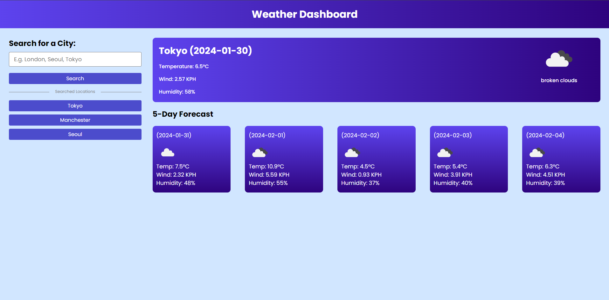
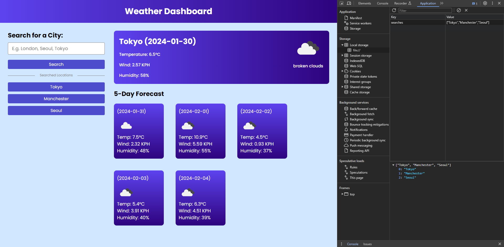
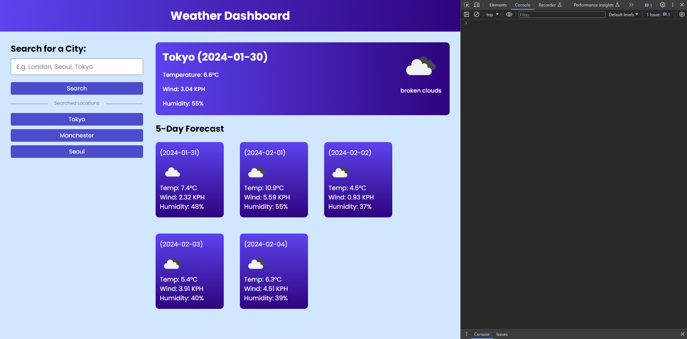

# Five-Day-Weather-App

App that will track weather forecast

# Daily-Planner

Daily business hours planner

## Description

- This weather forecast app will search for the country/city you want.
- It will give forecast of the current day and the next five days.
- Type the city you want to search for in the search box and click on the search button, or press enter.
- The previous searches will be displayed underneath the current search button.
- Click on the previous search button to bring up the forecast to those searches.

[GitHub page](https://github.com/Digita1Panda/five-days-weather-app)

[Five Day Weather Forecast](https://digita1panda.github.io/five-days-weather-app/)

## Installation

N/A

## Usage

## Credits

N/A

## License

MIT License

Copyright & All rights Reserved (c) 2023 Kwok Law

Permission is hereby granted, free of charge, to any person obtaining a copy of this software and associated documentation files (the “Software”), to deal in the Software without restriction, including without limitation the rights to use, copy, modify, merge, publish, distribute, sublicense, and/or sell copies of the Software, and to permit persons to whom the Software is furnished to do so, subject to the following conditions:

The above copyright notice and this permission notice shall be included in all copies or substantial portions of the Software.

THE SOFTWARE IS PROVIDED “AS IS”, WITHOUT WARRANTY OF ANY KIND, EXPRESS OR IMPLIED, INCLUDING BUT NOT LIMITED TO THE WARRANTIES OF MERCHANTABILITY, FITNESS FOR A PARTICULAR PURPOSE AND NONINFRINGEMENT. IN NO EVENT SHALL THE AUTHORS OR COPYRIGHT HOLDERS BE LIABLE FOR ANY CLAIM, DAMAGES OR OTHER LIABILITY, WHETHER IN AN ACTION OF CONTRACT, TORT OR OTHERWISE, ARISING FROM, OUT OF OR IN CONNECTION WITH THE SOFTWARE OR THE USE OR OTHER DEALINGS IN THE SOFTWARE.

---

## Badges

## Features

N/A

## Contributing

## Tests

N/A

---

Copyright © 2023 K.Law All Rights Reserved.
